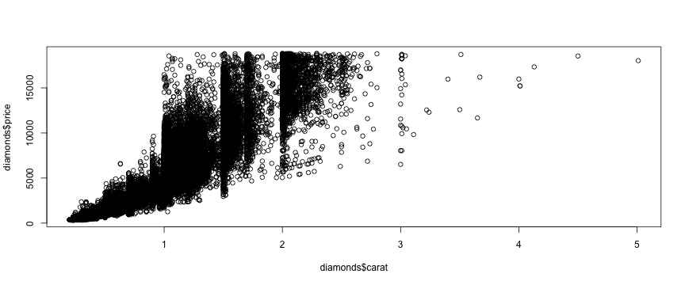
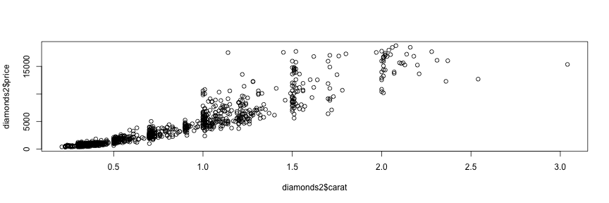

## Data Selection

For this project I chose to make an application using the Diamonds dataset from ggplot2.

I wanted to create an interactive tool that will allow a user to browse characteristics of diamonds in order to assist in their purchasing decision.

The Diamonds dataset contains 53,940 records of round cut diamonds along 10 variables. Plotting the entire dataset proved to be overwhelming, as 53k points is difficult to discern.
 

--- .class #id 

## Data Setup

The first step for the application was to reduce the dataset down to a useful size. I selected using 1,000 diamonds randomly sampled, as this gave the plot enough points to have a decent variety, without being too cluttered to use.

I next reviewed the 10 different variables to see which ones I would incorporate in the application, and which to exclude.

The initial variables are: price, carat, cut, color, clarity, length(x), width(y), depth(z), total depth percentage (a function of x,y,z), and table (the width of the top of the diamond relative to the widest point).

Because this application is intended for use by the typical consumer, I selected to only include price and what are known as the Four Cs (carat, cut, color and clarity).   

---

## Plot Design

With the variables selected, I next explored how best to visualize the dataset.

The price and carat are the only continuous variables in my selection, thus a scatterplot makes sense to visualize the relationship. With the reduced dataset, it is easier to explore the relationship.
 

The other Cs (cut, color and clarity) are all factor variables, so I used them to provide color to the plot.

---

## Final Application

To finish the application, I selected a few options to allow interactivity of the plot for the user.

The standard plot has carat on the x-axis, and price on the y-axis. 

The factor variables (cut, color, and clarity) can be swapped out to change the factors that make up the colors of the plot. This allows the user to review what weight/price combinations are available within each factor selection. 

Last, the price and carat ranges can be altered to allow the user to select a range that they are comfortable purchasing, and then see what they can expect to receive in terms of cut, color and clarity.

The final application allows the user to do their own data exploration and set a level of expectation before they shop for that diamond!

[Explore the Diamonds Application]( https://dmartin.shinyapps.io/DiamondsApplication/)

